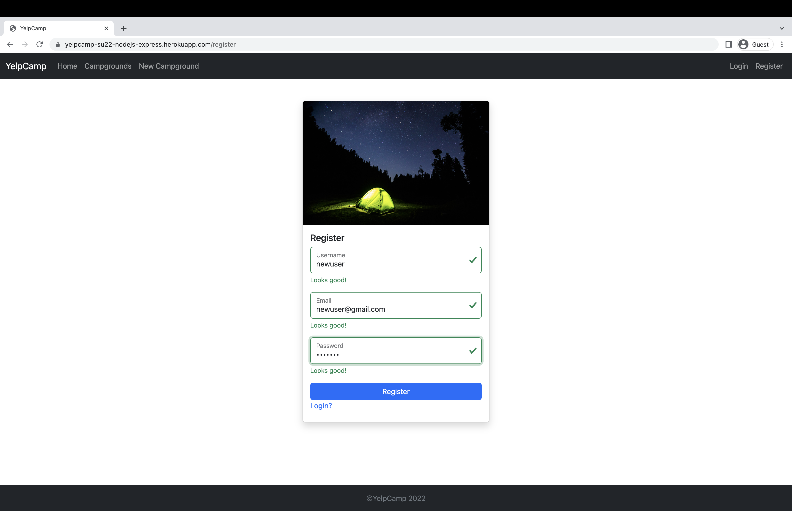
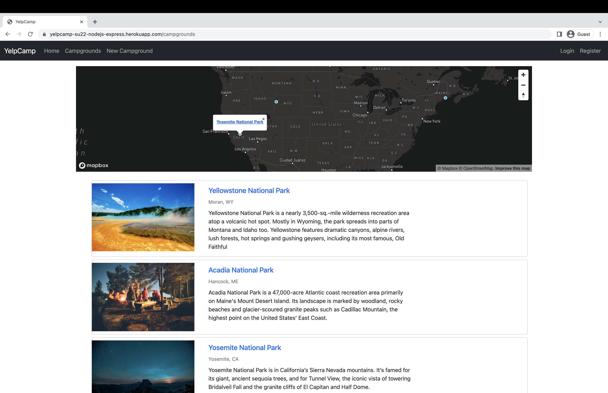
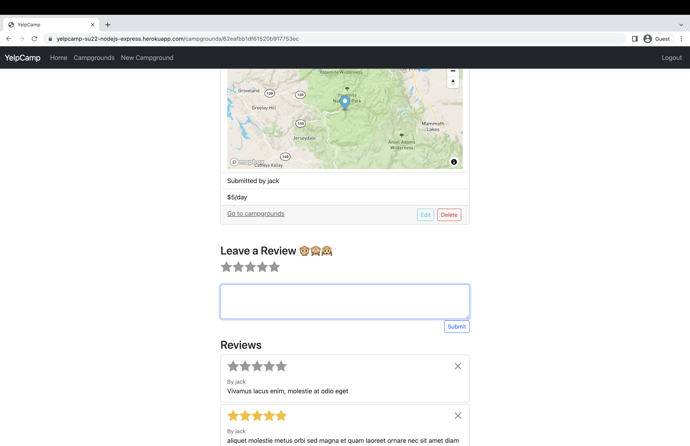
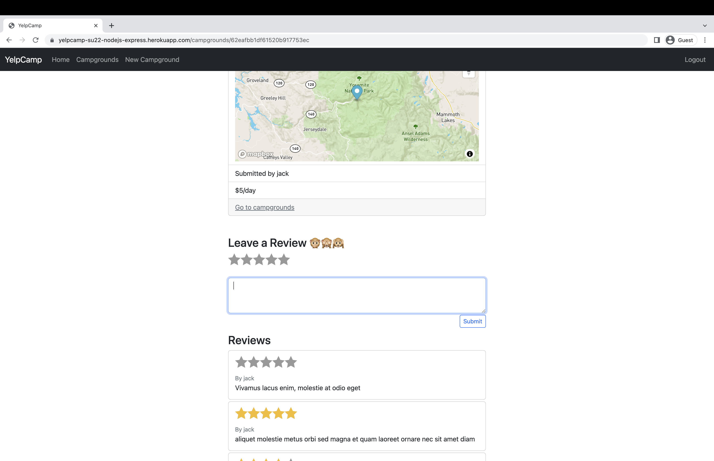

# YelpCamp🍁⛺️🎒

A full-stack web application for sharing camping site, powered by `Node.js`, specifically `express` for the server side. 

Visit [here](https://yelpcamp-su22-nodejs-express.herokuapp.com/)

## Features

- Styled with `Bootstrap`
- RESTful conventions
- MongoDB connection by `mongoose`
- Schema validation by `joi`
- Authentication and authorization based on data relationship
- Session and cookie enabled by `express-session`
- Map API by `mapbox`
- Deployed on `Heroku`

## Screenshots

- User register

- Map display

- Authorization based on data ownership

